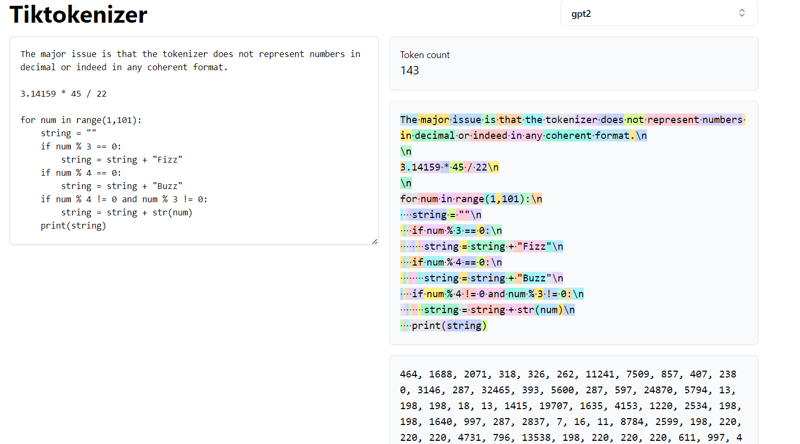

# Understanding Large Language Models

## Statistical Natural Language Processing

## Rise of Transformers

### A Neural Probabilistic Language Model (2003).

### Sequence to Sequence Learning with Neural Networks (2014).

### Neural Machine Translation By Jointly Learning To Align And Translate (2016).

### Attention is All you Need (2017).

- Everything only Attention, delete all RNN components.
- Positional Encodings.
- Residual Network (ResNet) Structure
- Interspersing of Attention and MLP.
- LayerNorms.
- Multiple Heads of Attention in Parallel.

## Tokenization

- Visual Web app: https://tiktokenizer.vercel.app/

- Why can't we directly use unicode of characters to feed to Transformers? 
    - Vocabulary will be very long. 
    - Unicode Consortium is always evolving. There is no constant source of mapping.
- 