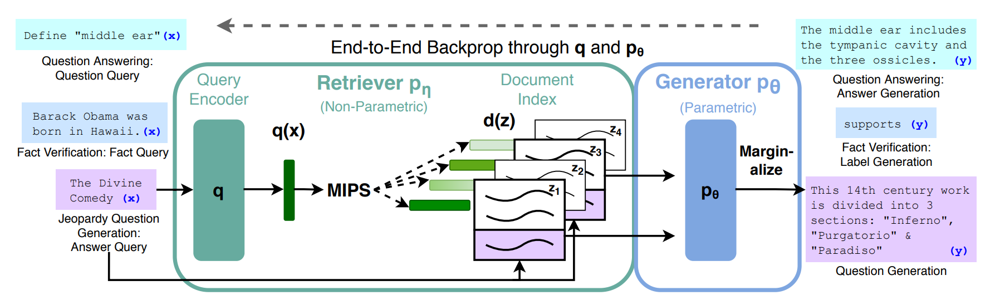
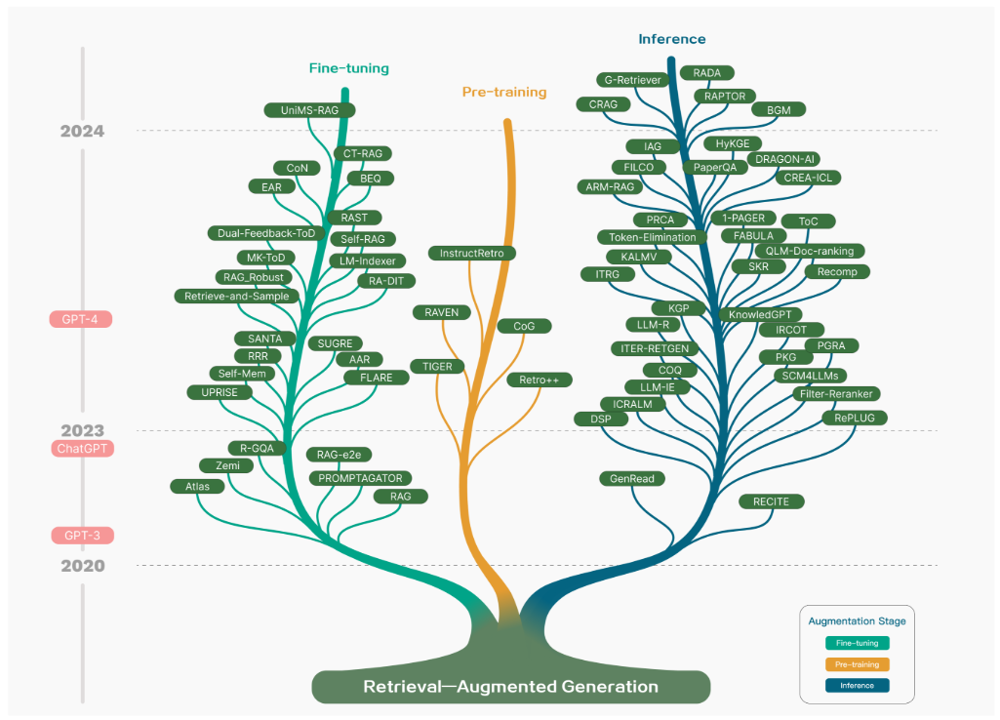
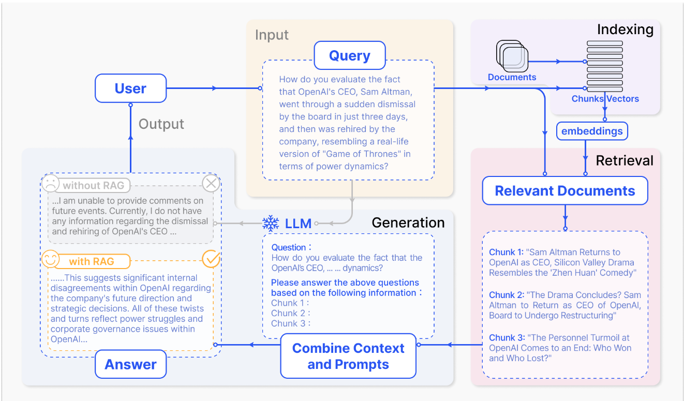
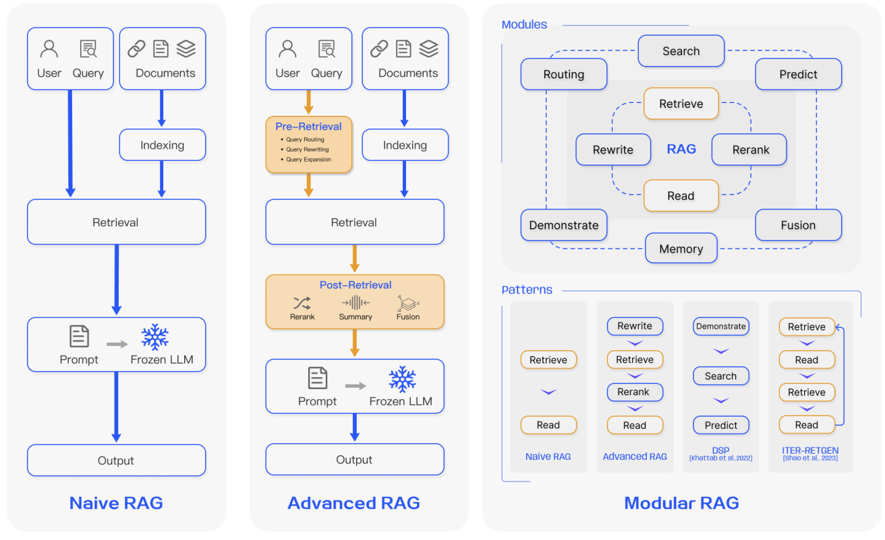
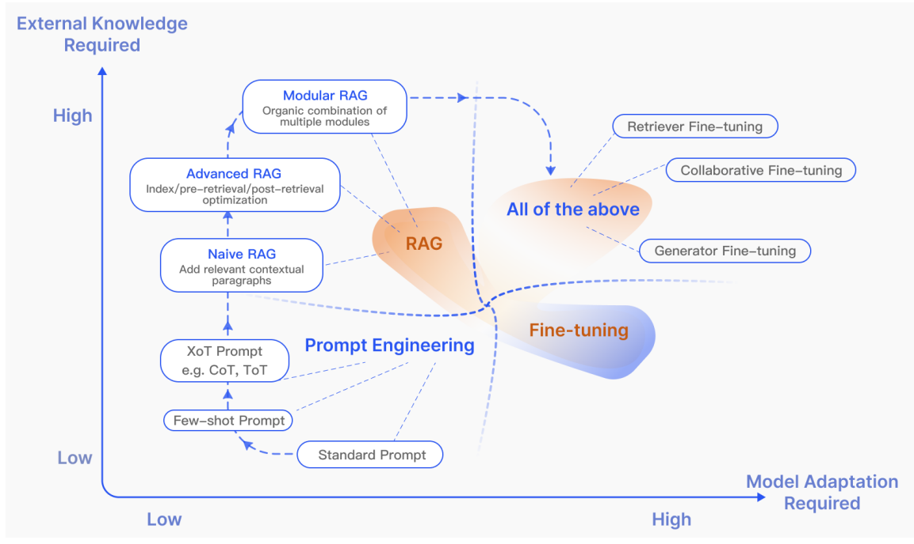
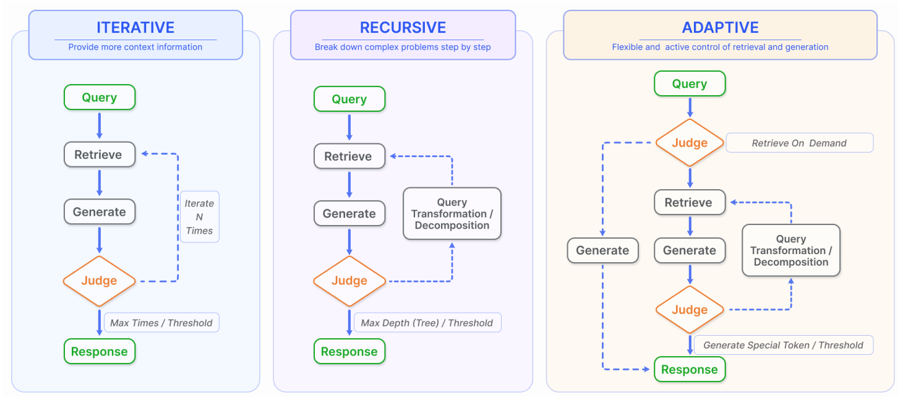

# Retrieval Augmentation Generation(RAG)

## Root of RAG: *Retrieval-Augmented Generation for Knowledge-Intensive NLP Tasks*

- RAG Paper Link: https://arxiv.org/pdf/2005.11401
- DPR Paper link: https://arxiv.org/pdf/2004.04906
- GitHub: https://github.com/huggingface/transformers/tree/main/examples/research_projects/rag

- RAG model is a hybrid model that combine parametric memories of seq2seq models with non-parametric (retrieval-based) memories.
- The issue with parametric pre-trained natural language models have been: 
    - They cannot easily expand or revise their memory.
    - They can't straightforwardly provide insight into their predictions.
    - They may produce hallucinations.
- The Parametric memory is a pre-trained seq2seq transformer, and the non-parametric memory is a dense vector index of Wikipedia, accessed with a pre-trained neural retriever. The components are combined in a probabilistic model trained end-to-end. The retriever(Dense Passage Retriever; in this case) provides latent documents conditioned on the input and the seq2seq model(BART; in this case) then conditions on these latent documents together with the input to generate the output. Latent documents with top-K approximation is marginalized either on a per-output basis or a per-token basis.
- Methodology
    - RAG models use input sequence $x$ to retrieve text documents $z$ and use it as additional context when generating the target sequence $y$.
    - There are two components:
        - A Retriever $p_{\eta}(z|x)$ with parameters $\eta$ that returns (top-K truncated) distributions over text passages given a query $x$.
        - A generator $p_{\theta}(y_i|x, z, y_{1:i-1})$ parameterized by $\theta$ that generates a current token based on a context of the previous i - 1 tokens, the original input and a retrieved passage.
    - Retriever and generator were trained end-to-end to treat the retrieved document as a latent variable.
    - Two models were proposed that marginalize over the latent documents in different ways to produce the distribution over generated text.
        - RAG-Sequence: Model uses same document to predict each target token.
        - RAG-Token: Predict each target token based on a different document.
    - RAG-Sequence Model:
        - It treats the retrieved document as a single latent variable thats is marginalized to get the seq2seq probability p(y|x) via top-K approximation.
        - $p_{RAG-Sequence}(y|x) \approx \sum_{z \epsilon top-K(p(.|x))}p_{\eta}(z|x)p_{\theta}(y|x, z) = \sum_{z \epsilon top-K(p(.|x))}\prod_{i}^{N}p_{\theta}(y_i|x, z, y_{1:i-1})$
    - RAG-Token Model
        - In the RAG-Token Model, we can draw a different latent document for each target token and marginalize accordingly. This allows the generator to choose content from several documents when producing an answer. Concretely, top K documents are retieved using the retriever and then generator produces a distribution for the next output token for each document before marginalizing and repeating the process with following output token:
        - $p_{RAG-Token}(y|x) \approx \prod_{i}^{N} \sum_{z\epsilon top-k(p(.|x))}p_{n}(z|x)p_{\theta}(y_i|x,z,y_{1:i-1})$
    - Retriever: DPR
        - The retrieval component is based on DPR.
        - DPR follows a bi-encoder architecture:
            - $p_{\eta}(z|x) \propto exp(d(z)^Tq(x))$
            - $d(z) = BERT_{d}(z), q(x) = BERT_{q}(x)$
            - $d(z)$ is a dense representation of a document produced by $BERT_{BASE}$ *document encoder* and $q(x)$ is a query encoder also based on $BERT_{BASE}$
            - Calculating $top-k(p_{\eta}(.|x))$, list of $k$ documents $z$ with highest prior probability $p_{\eta}(z|x)$ is a Minimum Inner Product Search(MIPS).
    - Generator: BART
        - Generator component $p_{\theta}(y_{i|x, z, y_{1:i-1}})$ could be modelled using any encoder-decoder.
        - BART-Large was used as a pre-trained seq2seq Transformer with 400M parameters.

## State of RAG

### Naive RAG
